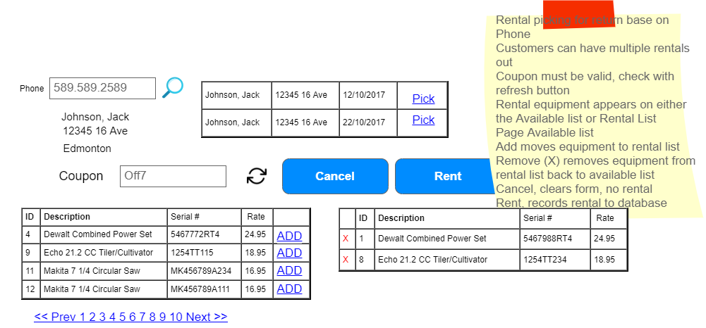
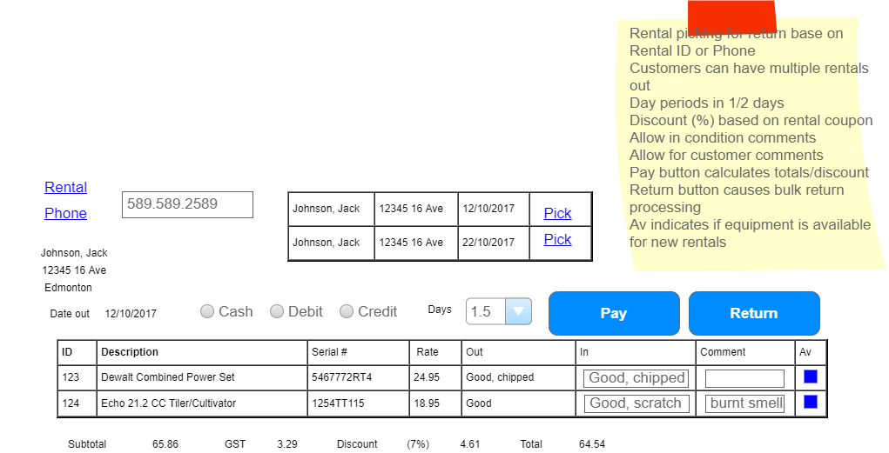
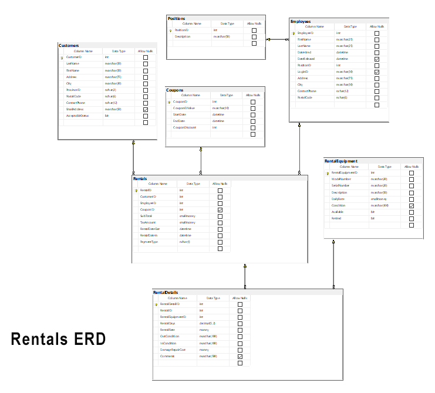

# Rentals

## Business Process Overview

> *Employees must log onto the system. Rentals must only allow authenicated users within the Rental Role to have access to the subsystem. An Associate or Department Head create rentals. The Employee full name must appear on the form in text mode*

The Rentals component requires the renter to have a customer record before the rental is done. You can assume this record exists. A rental record is created along with the rental detail(s) (each reflects a piece of rented equipment). Each rental of equipment is independent of previous rentals. Coupons are presented at the time of rental. Customers return rented equipment, it is checked, comments recorded and the rental is paid. Customers do **not do** partial returns. If the rental period for equipment is expected to be different, then separate rentals are created. Example: the customer expects to rent equipment a, b, c and d; a, b and c for 1 day but piece d for a week. Two rental contracts will be created; one for a, b, and c; one for piece d. The smallest rental period is 1/2 day. A customer must be in good standing to rent equipment

### Renting

A customer will enter the rental area, approach the rental counter and request one or more pieces of equipment. Once the associate determines the equipment is available, the rental checkout process starts. The customer is asked for their phone number and their information is displayed. From the list of available equipment, a particular piece is selected (serial number is vertified manually). This equipment is added to the rental. Any piece can be remove from the rental or the entire rental cancelled if the customer changes their mind. Equipment is checked before the customer leaves with the equipment to ensure it is in working order. The associate will demonstrate how to use the equipment. Payment is done at when the equipment is returned. 

#### Business Rules and Form Processing

- Rental is processed as one **bulk** transaction process.
- Rental may have several pieces of equipment.
- Only available equipment is shown and can be added to the rental.
- Coupons must be presented and verified at rental time.
- An employee can only rent equipment if logged in.
- Default rental days is 1. This can be altered on return of the equipment. Smallest rental period is 1/2 day.
- Rental rate is daily.
- The customer can have several rentals (separate rental contracts) out at one time.
- Rental date out is today's date and time.
- Default Rental date in is next day's date.
- Rental condition in is set to "out on rental"
- Damage repair cost is set to 0.0.
- Comments is set to null
- Subtotals and tax are set to 0.00.
- Default payment type to credit card
- Flag the equipment as unavailable
- Control Command Buttons
  - Add places rental equipment on rental list and removes from available list
  - Remove removes rental equipment from rental list back to available list
- Form Process Buttons
  - Cancel terminate current rental and clears form
  - Rent processes the current rental as a single transaction
    - A Rentals record is made
    - A RentalDetails record is made for each piece of rental equipment
    - RentalEquipment piece is flagged as not available

----

### Returns

The Return process begins with the customer returning the equipment. The rental is retreived by rental number (from rental from) or by customer phone number. The equipment associated with the rental is displayed. Rental equipment is manually examined for cleaning and operation. In Condition comments are recorded. The associate will ask the customer for any additional comments they wish to make. Time out periods are calculated by the associate and entered in 1/2 days. The equipment is returned and rental charges are calculated. The customer determines how payment is made and pays. 

#### Business Rules and Form Processing

- Equipment is not flagged as available unless returned in clean working order.
- Record incoming condition. (Can be set to Out Conditions by default when reebtal is rentaled).
- Add customer comments (if any).
- Any recorded coupon is apply to the pricing of the rental
- Payment types are 'M', 'C', or 'D', for 'Money', 'Credit' and 'Debit', respectively
- Subtotal, GST, Discount, and Total calculated on returned items.
- Subttotals and tax are pre-coupon calculation.
- Rental date in is today's date and time.
-Control Command Button
  - Select get customer information and outstanding rental(s)
  - View get outstanding rental
- Form Process Buttons
  - Pay button. Calculate costs. Requires rental length (Days) be present.
  - Rental will do a bulk update processing of the rental information.
    - Update Rentals record: subtotal, taxes, rental date in, payment type, employeeid
    - Update RentalDetail records: rental days, In condition, Comments
    - Update RentalEquipment records: Condition, Available
- 

----

*Back to the [General Instructions](./../README.md)*